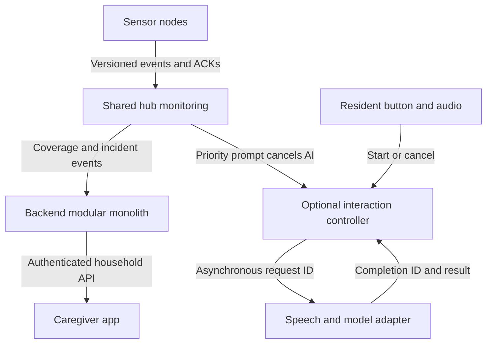
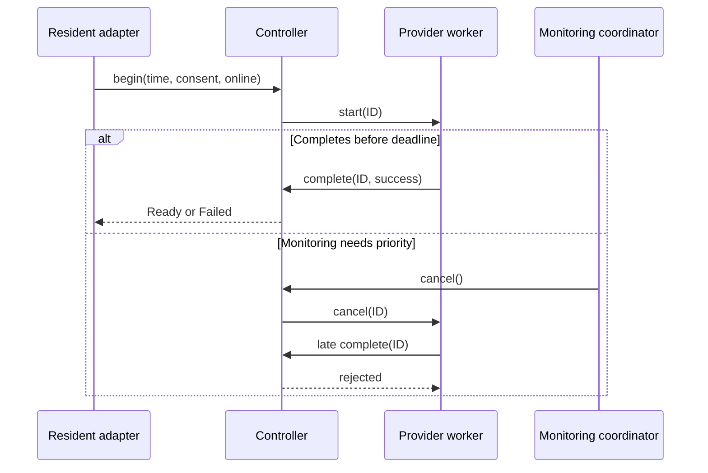

# Status note — synchronized release 1.4.1

The revised Word documents in the bundle docs/ directory and IMPLEMENTATION_STATUS.md supersede this original 1.4.0 architecture addendum for status and module numbering. The interaction API remains unchanged.

# Ghar Sajag shared-product architecture — 1.4.0

Parivar Saathi is the non-AI edition. Sarthi-AI adds optional resident-initiated
interaction. Both reuse node firmware, monitoring, incident and caregiver logic.
This is an additive HLD/LLD for the existing reference; earlier Word documents
remain historical baselines. This release is not flashable firmware or a chatbot.

## System design

These are target integration relationships. The new executable relationship is
Controller to fake Provider. Real coordinator, audio and cloud wiring is pending.
AI output must never count as motion, wellbeing, medication taken, acknowledgement
or authorization to suppress an alert.

## Modules and reuse
| Module/files | Responsibility | Delivery state |
|---|---|---|
| firmware/node | Sensing, event production and node state | Existing host logic; drivers pending |
| firmware/hub | Ingest, journal, coverage, routine and cloud policy | Existing host logic; transport pending |
| backend/ghar_sajag | Homes, roles, incidents and notifications | Existing reference; production services pending |
| app/src | Caregiver domain behavior | Existing reference; integrated product UI pending |
| shared/include/gs/product.hpp | Product name, version and AI build flag | New, tested |
| shared/include/gs/interaction.hpp | Bounded interaction lifecycle | New, tested |
| tests/cpp/test_product.cpp | Base/AI admission and failure regression | New, tested |
| Future audio and model adapters | Capture, speech, provider streaming | Not implemented |

## Build policy
`make verify PRODUCT=base` is default; `make verify PRODUCT=ai` selects Sarthi-AI.
`make verify-products` tests both. PRODUCT values other than base/ai fail. The
GS_PRODUCT_AI macro accepts only 0 or 1. Base begin() returns Disabled without
calling Provider. No real AI library is linked in either edition today.
Old GS_FEATURE_* flags keep their prior behavior: full enforcement across all
legacy modules remains incomplete. Backend/UI product capability synchronization
is a future interface, not yet implemented. UI flags must not authorize actions.

## Hardware
C3 sensor nodes remain common. Keep DevKit V1 for the base prototype. S3 with
PSRAM, microphone and amplifier/speaker is a candidate AI hub; pinout, memory,
power and speech load require qualification. Same source does not mean the same
binary across ESP32/C3/S3. Conversational inference is not implemented locally.
A future cloud provider introduces recurring usage cost and connectivity needs.

## Interaction low-level design
Controller stores a Provider reference, State, 64-bit request ID and start time.
It performs constant-time transitions without heap allocation or payload copies.
One session can be active. Provider must outlive Controller. start/cancel must
return promptly, be noexcept and not reenter Controller. A single owner task
calls all methods; provider completions must be queued back to that task.

begin(monotonic_ms, consent, online) rejects disabled edition, missing consent,
offline, busy and exhausted ID counter. Accepted means admitted; state can become
Failed immediately if provider start fails. Waiting expires at 30 seconds via
tick(). complete(ID, success) rejects stale/duplicate/late completion. cancel()
returns to Idle and cancels a waiting provider. Application coordinator must call
cancel on consent revocation or higher-priority monitoring prompts. Audio adapter
must separately stop playback and clear buffers. No transcript is logged.
IDs are unique during controller lifetime only; adapters must discard callbacks
on reboot/destruction. Inputs require monotonic time, not wall-clock time.

## Scalability and performance plan
Keep one owner of hub monitoring state. Radio callbacks enqueue bounded events;
network and audio belong on independent workers. Monitoring must not wait on AI.
Task priorities, queue sizes and stacks need hardware measurement. Controller
sizeof is printed in host tests; it is not an ESP32 RAM measurement. Existing
core containers are not claimed heap-free. Existing logging may block on IO:
firmware needs a bounded diagnostic queue and lower-priority writer.

Use a modular backend monolith initially. Add durable database/outbox before
deployment; scale workers by measured queue depth. Partition by household ID and
authorize every query. Deduplicate by node/session/sequence; at-least-once events
need idempotent consumers. A future capability API should distinguish compiled
support, purchased edition, resident consent and runtime availability. AI gateway
needs per-household quotas, concurrency limits, secure credentials and retention
policy before provider use. These backend changes are designed, not delivered.

## Acceptance and development order
New tests cover provider exclusion in Base, consent/offline rejection, busy,
timeout boundary, cancellation, stale/duplicate results and start failure. They
use a fake provider. Run all existing regression tests for both products.

1. Create pinned ESP-IDF projects and board profiles.
2. Wire monitoring event to persistence, coverage and alert first.
3. Validate restart/power loss, transport recovery and bounded diagnostics.
4. Integrate AI button/audio and single-owner controller.
5. Implement provider gateway, consent revocation and budget limits.
6. Measure noisy-room quality, RAM/current and monitoring latency under AI load.

AI release gates: no monitoring regression under maximum audio load; no capture
without consent; physical cancel works offline; repeated sessions have bounded
memory; cost per household is measured. Fall detection and professional emergency
response remain outside current P0. No sales or availability assumptions made.
